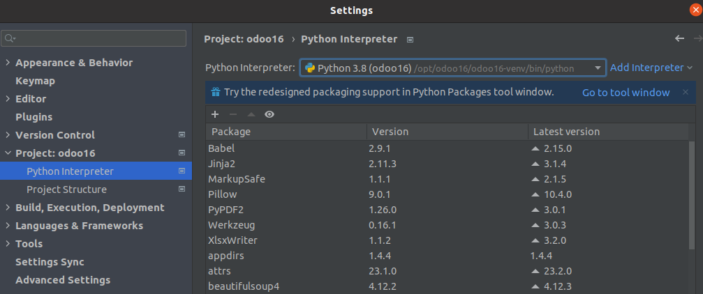
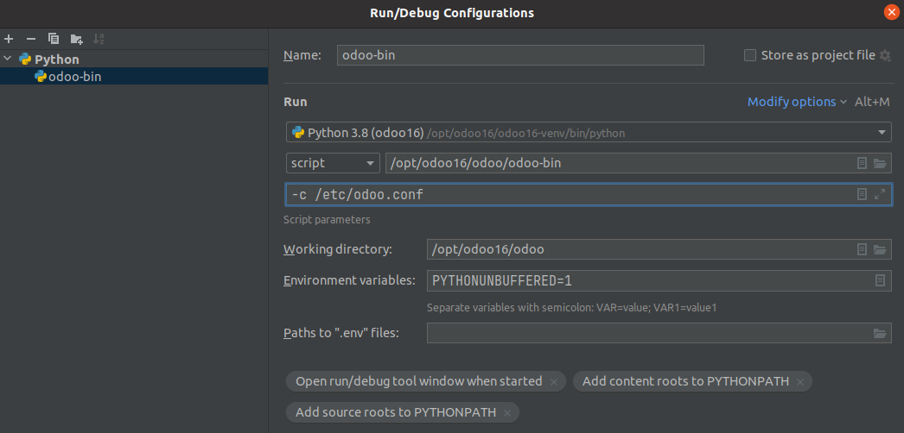

### Install Pycharm IDE
1. Pycharm is available in 3 different Editions: Education, Community, and Enterprise. Here we are going to install the Pycharm Community edition and to run Pycharm you need certain minimum system requirements.

Open Terminal (you can use Ctrl + Alt + T to open terminal) and execute the following commands:

```sh
sudo apt-get update 
sudo apt-get upgrade
sudo snap install pycharm-community --classic
```
or you can download from he following link [Download Pycharm](https://www.jetbrains.com/pycharm/download/download-thanks.html?platform=linux&code=PCC)

2. Giving permission for /opt/odoo16. previouly it created with user odoo so your user may not have authorizations

```sh
sudo chmod -R 777 /opt/odoo16/
```

3. After Pycharm opened Select File > Open.   then select the Project location /opt/odoo16

4. Add a configuration for the project as follows:

open settings 

confiugre Interpreter. select odoo16-venv. If you don't see at the options that needs to be added. browse the location /opt/odoo16/odoo16-venv/bin/python  


open Run Configuraitons: 


Configure as follows:



change odoo.conf settings `/etc/odoo.conf`

```sh
[options]
; Is This The Password That Allows Database Operations:
;admin_passwd = admin
db_host = localhost
db_port = 5432
db_user = odoo16
db_password = "enter-your-db-password"
addons_path = /opt/odoo16/odoo/addons,/opt/odoo16/odoo-custom-addons
```